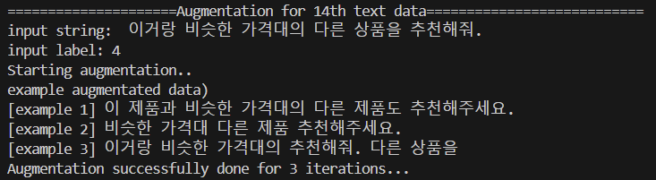

# chatbot-augmentation
<b> [캡스톤디자인프로젝트] Chatbot 학습을 위한 Data Augmentation </b>

챗봇 모델의 <b>학습 데이터</b>를 구축하기 위한 텍스트 증강 기능을 제공하는 repo입니다. <br>
이 repo에서 제공하는 augmentation은 다음과 같습니다: <br>
<b>1. Synonym Replacement(SR)</b>: Korean WordNet 데이터셋에 존재하는 동의어로 특정 단어를 치환합니다. <br>
<b>2. Random Insertion(RI)</b>: 입력 데이터의 일부를 무작위로 다시 삽입합니다. <br>
<b>3. Random Swap(RS)</b>: 입력 데이터 중 일부의 순서를 치환합니다. <br>
<b>4. Back Translation</b>: 입력 데이터를 다른 언어로 번역한 후, 번역된 텍스트를 다시 한국어로 번역합니다. <br>
사용한 언어 목록은 다음과 같습니다: `'en', 'es', 'fr', 'it', 'ja', 'pl', 'ro', 'tr', 'zh-CN', 'sv'` <br>
(GoogleTranslator 지원 언어: https://developers.deepl.com/docs/resources/supported-languages)

 
### 실행 방법
<b>(1) git clone</b> <br>
```python
git clone https://github.com/dev-munchkins/chatbot-augmentation.git
```

<b>(2) base_text_file 생성</b>  <br>
파일을 실행하기 전에, augment하고자 하는 텍스트들이 저장된 .csv 파일을 생성해야 합니다. csv 파일의 columns는 'text'와 'label'임을 가정합니다. 'text'열에는 입력 데이터를, 'label'은 해당 텍스트를 분류하고자 하는 class 번호를 작성하면 됩니다.

<b>(3) cmd 실행</b>  <br>
```python
python chat_augmentation.py --base_path '/path/to/base_text_file' --save_path '/path/to/output_file'
```

### 실행 옵션
| Argument | 설명 |
|-------|-------|
| --base_path | augment하고자하는 텍스트가 들어있는 .csv 파일 경로 |
| --save_path | augment 완료된 텍스트를 저장할 .csv 파일 경로 |
| --n_iters | 1 set의 augmentation을 반복할 횟수 |
| --syn_replace_num | 1 iteration동안 SR을 반복할 횟수 |
| --rand_ins_num | 1 iteration동안 RI을 반복할 횟수 |
| --rand_swap_num | 1 iteration동안 RS를 반복할 횟수 |


### 출력
콘솔에서 다음과 같이 현재 augmentation을 수행하고 있는 문장, 해당 문장의 label, 일부 augmentation 결과를 확인할 수 있습니다. <br>
 <br> <br>
모든 과정이 완료되면 `--save_path`에서 지정한 경로에 augmented data가 저장됩니다.
